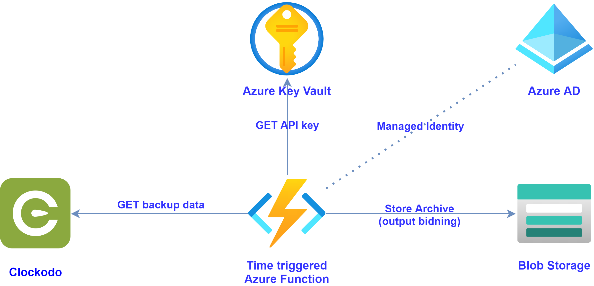

<h1 align="center">
   
  
   
  Clockodo automation
   
</h1>

  
  
  
  
  
  

---

  

---
## The purpose of this project are two things:

- Provide additional features around clockodo like automated backup, analytics or alerting.
- Serve as a learning environment for white duck 🦆 employees. Quack quack

## Technologies

- C# .NET 5
- Azure Biceps 💪 to generate ARM templates
- DevContainer

---
