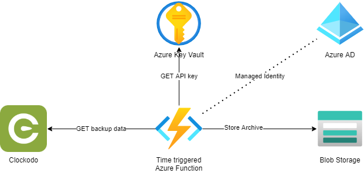

# Clockodo automation

The purpose of this project are two things:

- Provide additional features around clockodo like automated backup, analytics or alerting.
- Serve as a learning environment for white duck 🦆 employees. Quack quack

## Technologies

- C# .NET 5
- Azure Biceps 💪 to generate ARM templates
- DevContainer

